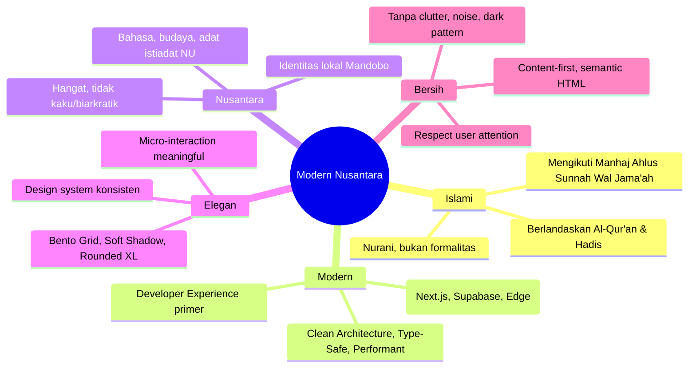
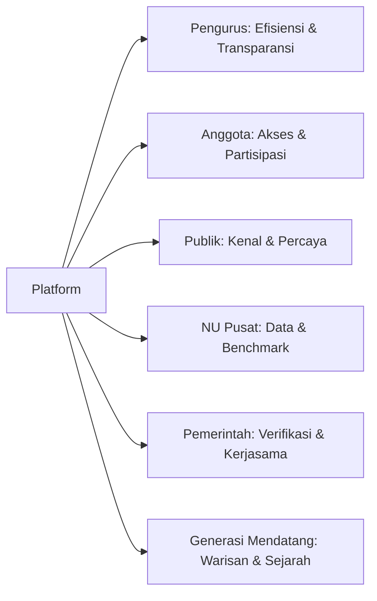

# Product Vision: MWCNU Mandobo Web Platform

---

## 1. Vision Statement

> **"Menjadikan MWCNU Mandobo sebagai teladan organisasi NU berplatform digital yang transparan, aksesibel, dan berkelanjutan — membangun jembatan antara tradisi Nahdlatul Ulama dan kebutuhan zaman, tanpa meninggalkan identitas."**

---

## 2. Mission

| Mission | Description |
|---------|-------------|
| **M1: Transparansi** | Menyediakan akses terbuka ke informasi organisasi: struktur, keputusan, program, keuangan (fase 2) |
| **M2: Aksesibilitas** | Memastikan platform usable oleh semua kalangan: pengurus, anggota, jamaah, publik, termasuk penyandang disabilitas (WCAG AA) |
| **M3: Kelestarian** | Membangun arsip digital terpusat yang terjamin keamanannya, mudah dicari, dan bertahan lintas generasi pengurus |
| **M4: Regenerasi** | Mempermudah kader muda memahami sejarah, struktur, dan warisan intelektual NU Mandobo |
| **M5: Dakwah Modern** | Menyebarkan nilai-nilai NU (Tawasuth, I'tidal, Tasamuh, Tawazun) melalui konten digital yang berkualitas |

---

## 3. Core Values (Nilai-Nilai Inti)



---

## 4. Target Audience (Primary → Secondary)

| Priority | Audience | Needs | Platform Role |
|----------|----------|-------|---------------|
| **P1** | **Pengurus MWCNU** | Kelola konten, arsip, struktur, program kerja | CMS, Dashboard, Reporting |
| **P2** | **Anggota/NU Mandobo** | Cari info: pengurus, agenda, kajian, dokumen | Search, Directory, Archive |
| **P3** | **Jamaah Umum/Publik** | Kenal NU Mandobo, baca berita, unduh khutbah | Public Website, SEO, Social Share |
| **P4** | **Organisasi NU Lain** | Referensi struktur, kolaborasi, benchmark | Public Profile, API (future) |
| **P5** | **Pemerintah/Instansi** | Verifikasi keabsahan, kerjasama | Official Documents, SK |

---

## 5. Key Differentiators (USP)

| Differentiator | Description | Why It Matters |
|----------------|-------------|----------------|
| **Struktur Organisasi Interaktif** | Bukan gambar statis — tree navigable, klik → detail pengurus + masa khidmat | Mempermudah regenerasi & transparansi |
| **Arsip Hukum Terintegrasi** | SK, Surat, Notulen terhubung ke pengurus & agenda terkait | Good governance, audit trail |
| **Multi-format Kajian** | PDF + Audio + Video dalam satu entitas, dengan playlist & offline-ready | Dakwah menjangkau semua lapisan |
| **Modern Nusantara Design** | Bukan template pemerintah/korporat — identitas NU yang hangat & elegan | Brand recognition, emotional connection |
| **AI-Ready Architecture** | Repository pattern, typed APIs, structured content — siap untuk AI features v2+ | Future-proof, low technical debt |
| **Performance-First** | ISR, Image Optimization, Edge Functions, Lighthouse > 95 | Akses di daerah 3G/4G, UX superior |

---

## 6. Product Principles

| Principle | Application |
|-----------|-------------|
| **Content over Chrome** | UI tidak berkompetisi dengan konten; whitespace generous, typography readable |
| **Progressive Enhancement** | Core content accessible tanpa JS; enhancement untuk interaktivitas |
| **Mobile-First, Desktop-Enhanced** | 375px breakpoint priority; Bento Grid reflow natural |
| **Privacy by Design** | Minimal data collection, no third-party trackers, RLS enforced |
| **Offline-Resilient** | Service Worker untuk cache konten kritis (kajian, dokumen) |
| **Internationalization-Ready** | i18n routing structure dari awal, meskipun v1.0 hanya Bahasa Indonesia |
| **Observability Built-in** | Structured logging, error tracking, performance monitoring dari hari 1 |

---

## 7. Success Metrics (North Star + Supporting)

### 7.1 North Star Metric
> **Monthly Active Information Seekers (MAIS)** — Jumlah unique visitors yang mengakses minimal 2 halaman konten substansial (berita, kajian, dokumen, profil) per bulan.

### 7.2 Supporting Metrics
| Category | Metric | Target v1.0 |
|----------|--------|-------------|
| **Reach** | Monthly Unique Visitors | 5,000+ |
| **Engagement** | Avg Session Duration | > 3 menit |
| **Engagement** | Pages per Session | > 3 |
| **Content** | Search Success Rate | > 80% |
| **Content** | Document Download/Month | 500+ |
| **Governance** | SK/Surat Published on Time | 100% |
| **Governance** | Pengurus Profile Completeness | 100% |
| **Technical** | Lighthouse Score (all) | > 95 |
| **Technical** | Error Rate | < 0.1% |
| **Adoption** | Admin Daily Active Users | > 50% pengurus |

---

## 8. Brand Positioning

```
┌─────────────────────────────────────────────────────────────┐
│                    MWCNU MANDOBO                            │
│         Modern Nusantara Digital Platform                   │
├─────────────────────────────────────────────────────────────┤
│  Bukan:     │  Tetapi:                                      │
│  ────────    │  ────────                                    │
│  Kaku       │  Hangat & Humanis                             │
│  Biarkratik │  Efisien & Transparan                         │
│  Tersendat  │  Modern & Terkini                             │
│  Tertutup   │  Terbuka & Aksesibel                          │
│  Statis     │  Dinamis & Berkelanjutan                      │
└─────────────────────────────────────────────────────────────┘
```

---

## 9. Tagline Options

1. **"NU Mandobo: Tradisi yang Hidup, Teknologi yang Bermakna"**
2. **"Menghubungkan Generasi, Melayani Jamaah"**
3. **"Digital Platform Nahdlatul Ulama Distrik Mandobo"**
4. **"Warisan NU, Wujud Digital"**

> **Rekomendasi:** Opsi 1 — mengandung kontras tradisi/teknologi + nilai "bermakna"

---

## 10. Vision Timeline

| Horizon | Focus | Key Milestone |
|---------|-------|---------------|
| **Now (v1.0)** | Foundation | Public website live, CMS operational, arsip terpusat |
| **6 Months (v1.1)** | Adoption | Member portal beta, 80% pengurus aktif, content fresh < 7 hari |
| **1 Year (v2.0)** | Expansion | Mobile app (PWA → Native), multi-format kajian streaming |
| **2 Years (v2.1)** | Maturity | Keuangan digital, keanggotaan, donasi online, API ekosistem |
| **3 Years (v3.0)** | Intelligence | AI-assisted content, chatbot dakwah, predictive analytics |

---

## 11. Constraints & Boundaries

| Constraint | Boundary |
|------------|----------|
| **Budget** | Operational cost < $50/bln (Vercel + Supabase Pro) |
| **Team** | 2-3 developer part-time, 1 content admin |
| **Timeline** | MVP launch ≤ 12 minggu dari kickoff |
| **Tech** | Stack tetap: Next.js + Supabase + Tailwind + shadcn/ui |
| **Compliance** | Data stay in Indonesia (Supabase region SG/JKT), PDP compliant |
| **Brand** | Tidak boleh menyimpang dari Modern Nusantara design system |

---

## 12. Stakeholder Value Map



---

*Document Version: 1.0 | Last Updated: 2026-08-04 | Classification: Internal*